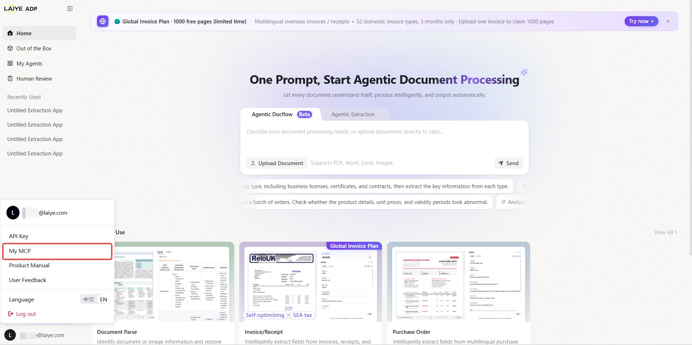
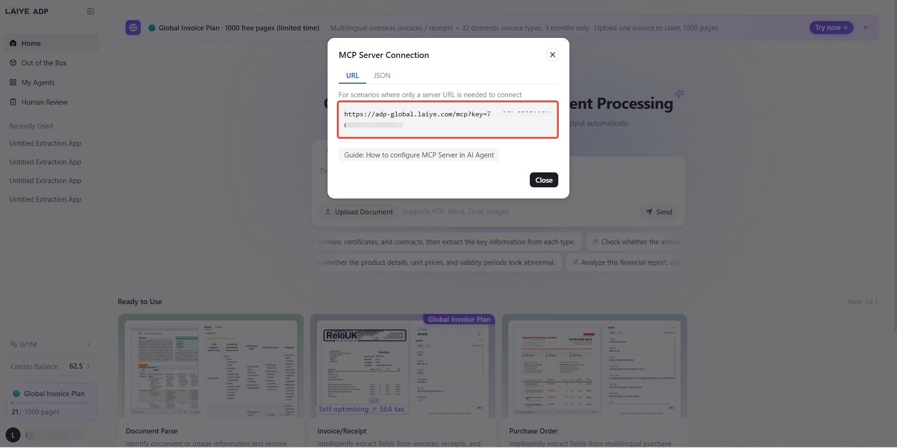
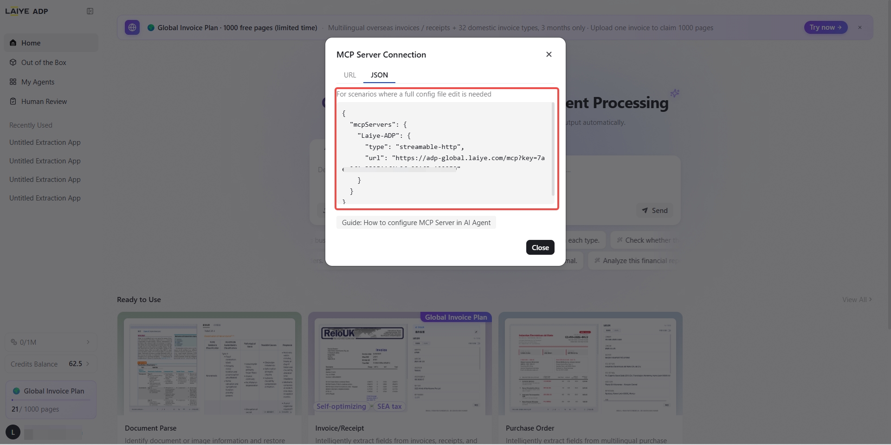

## About ADP MCP Server

ADP MCP Server is the Model Context Protocol endpoint for Laiye's **Agentic Document Processing (ADP)** platform. It lets any MCP-compatible AI client — Claude Desktop, Cursor, Copilot Chat, Tongyi Lingma, Coze, and others — invoke ADP's document parsing and extraction capabilities without writing a single line of code.Unlike the CLI, the MCP Server runs over **Streamable HTTP** transport. A single connection is all you need to discover available tools, invoke processing, and query results — entirely within your chat window.

ADP integrates Vision-Language Models (VLM), Large Language Models (LLM) and autonomous agent decision-making technologies. It reshapes traditional document processing by transforming conventional rule-based field extraction into goal-driven end-to-end intelligent automation. Focused on intelligent processing of business documents, ADP automatically classifies overseas invoices, domestic vouchers, procurement contracts, logistics documents, financial statements and trading contracts, and accurately extracts key fields. It also supports table parsing, content verification and multilingual recognition. Requiring no template setup, data labeling or ongoing rule maintenance, it efficiently handles high-volume document processing tasks.

---

## Quick Start

### 1. Get Your API Key

Sign up at [https://adp-global.laiye.com/](https://adp-global.laiye.com/?utm_source=github) and retrieve your API Key from **My MCP** in personal settings.

<div align="center">
  
  
  
</div>

### 2. Configure Your MCP Client

The ADP MCP Server runs over **stdio** transport: the client launches a local process via `npx` and passes your API Key through an environment variable. Add the following to your client's MCP config file (e.g. Claude Desktop's `claude_desktop_config.json`, Cursor's `mcp.json`):

```json
{
  "mcpServers": {
    "adp": {
      "command": "npx",
      "args": ["-y", "@laiye-adp/mcp"],
      "env": {
        "ADP_API_KEY": "<YOUR-ADP-API-Key>"
      }
    }
  }
}
```

The same parameters apply to any MCP client:

| Parameter | Value |
|-----------|-------|
| **Command** | `npx` |
| **Args** | `["-y", "@laiye-adp/mcp"]` |
| **Transport** | stdio |
| **Authentication** | Environment variable `ADP_API_KEY=<YOUR-ADP-API-Key>` |

> The optional environment variable `ADP_ACCEPT_LANGUAGE` (`zh` / `en`, default `zh`) switches the API language and domain.
> Requires Node.js 20+ installed locally.

### 3. Start Using

Once connected, your AI client will automatically discover all available ADP tools. Just describe what you need in natural language:

- "Parse the structure of this PDF"
- "Extract the information from this ID card"
- "Pull the amount and date from this invoice"

---

## Tool Catalog

### Document Parsing

| Tool Name | Title | Description |
|-----------|-------|-------------|
| `parse_document` | General Document Parsing | Parse PDF, image, Word, Excel, PPT and other documents for layout analysis, returning structured text blocks, tables, reading order and page coordinates. Use when the document type is unknown and you need raw structure for further processing; for invoices, ID cards or other specific types, prefer the dedicated extraction tool. |

### Invoice & Order Extraction

| Tool Name | Title | Description |
|-----------|-------|-------------|
| `extract_china_invoice` | China Invoice / Bill | Covers 30+ common Chinese bill types: fully-digitalized e-invoices, general VAT invoices, special VAT invoices, taxi receipts, train tickets, air itineraries, fiscal invoices, etc. Extracts invoice number, date, amount, buyer, seller and other key fields; also supports invoice authenticity verification. |
| `extract_global_invoice` | Global Invoice / Receipt | Extract key fields (invoice number, date, amount, tax, currency, line items, etc.) from overseas invoices, receipts or bills in PDF or image format. Ideal for cross-border trade, reimbursement and accounts-payable automation; for Chinese VAT invoices, use the dedicated China invoice tool. |
| `extract_purchase_order` | Purchase / Sales Order | Extract key fields (order number, buyer/seller info, order date, item details, quantity, unit price, total amount, shipping address, etc.) from purchase or sales orders in PDF or image format. Suitable for e-commerce order entry, supply-chain reconciliation and warehouse management automation. |

### Card & Certificate Extraction

| Tool Name | Title | Description |
|-----------|-------|-------------|
| `extract_id_card` | China ID Card | Extract key fields (name, gender, ethnicity, date of birth, ID number, address, issuing authority, validity period, etc.) from Chinese mainland resident ID card images. Supports both front and back sides. For HK/Macao/Taiwan permits or passports, use the corresponding tool. |
| `extract_bank_card` | Bank Card | Extract key fields (card number, issuing bank, card type, expiration date, etc.) from the front side of a bank card image. Only public card-face information is recognized; sensitive fields such as CVV are not extracted. |
| `extract_vehicle_cert` | Vehicle Certificate | Extract key fields (certificate number, vehicle brand, model, VIN, engine number, manufacturing date, etc.) from vehicle certificate of conformity images. Suitable for vehicle registration, used-car transactions and fleet management. |
| `extract_account_permit` | Bank Account Permit | Extract key fields (company name, basic account number, bank name, approval number, issue date, etc.) from corporate bank-account opening permit images. |
| `extract_driver_license` | China Driver License | Extract key fields (name, gender, nationality, date of birth, license number, permitted vehicle class, first issue date, validity period, etc.) from Chinese motor-vehicle driver license images. Supports both main and supplementary pages. |
| `extract_business_license` | Business License | Extract key fields (company name, unified social credit code, legal representative, registered capital, establishment date, business scope, registered address, etc.) from Chinese business license images. |
| `extract_passport_cn` | China Passport | Extract key fields (Chinese name, romanized name, gender, date of birth, passport number, nationality, issue date, validity period, issuing authority, etc.) from PRC passport images. Foreign passports are not supported. |
| `extract_vehicle_license` | Vehicle License | Extract key fields (plate number, vehicle type, owner, VIN, engine number, registration date, issue date, etc.) from Chinese motor-vehicle license images. Supports both main and supplementary pages. |
| `extract_org_code_cert` | Organization Code Certificate | Extract key fields (organization name, organization code, legal representative, address, issue date, validity period, etc.) from organization code certificate images. For newly registered enterprises, use the Business License tool instead. |
| `extract_household_book` | Household Register | Extract key fields (household number, household type, address, family member list including name, ID number and relationship to head of household, etc.) from Chinese household register (Hukou) images. Supports both index and individual pages. |
| `extract_hk_macao_permit` | HK/Macao Travel Permit | Extract key fields (name, gender, date of birth, permit number, issue date, validity period, issuing authority, etc.) from Exit-Entry Permit for Travelling to and from Hong Kong and Macao images. |

### Custom Extraction

In addition to the out-of-the-box tools above, MCP provides two fixed tools for working with custom extraction apps you create on the ADP platform:

| Tool Name | Title | Description |
|-----------|-------|-------------|
| `list_custom_extract_apps` | List Custom Extraction Apps | List all custom document extraction apps created by the current user, returning each app's ID, name, description, labels and output field definitions. Use this to find the `app_id` needed by `execute_custom_extract_app`. |
| `execute_custom_extract_app` | Execute Custom Extraction App | Process a file using a specified custom document extraction app. Use `list_custom_extract_apps` first to obtain the `app_id`. |

**Workflow:** Call `list_custom_extract_apps` to browse available apps and get the target `app_id`, then call `execute_custom_extract_app` with the `app_id` and file to perform extraction.

---

## Tool Input Parameters

### Document Parsing & OOTB Extraction Tools

All out-of-the-box tools share a unified input schema:

| Parameter | Type | Required | Description |
|-----------|------|----------|-------------|
| `file` | string | Yes | File URL or Base64-encoded content |
| `file_name` | string | No | File name (with extension) |
| `with_rec_result` | boolean | No | Whether to include OCR intermediate results, default `true` |
| `wait` | boolean | No | Whether to wait synchronously for the result, default `true` |
| `timeout_seconds` | integer | No | Synchronous wait timeout in seconds, default `300`, range 1–900 |

### execute_custom_extract_app

In addition to the parameters above:

| Parameter | Type | Required | Description |
|-----------|------|----------|-------------|
| `app_id` | string | Yes | Custom extraction app ID (obtained from `list_custom_extract_apps`) |

### list_custom_extract_apps

No input parameters required.

**File input methods:**

- **URL**: pass a link starting with `http://`, `https://`, or `file://` as `file`
- **Base64**: pass Base64-encoded file content as `file` (auto-detected when not a URL)

**Sync vs Async:**

- `wait=true` (default): blocks until processing completes, returns the result directly
- `wait=false`: returns immediately with a `task_id` for later status queries

---

## Tool Output

### parse_document Output

```json
{
  "task_id": "fabd7f0a4e7211f1bbc4d85ed35661fd",
  "status": 4,
  "message": "",
  "doc_recognize_result": [
    {
      "page_num": 1,
      "document_content": "Full text content of this page...",
      "document_details": [
        {
          "type": "Text",
          "text": "Paragraph content...",
          "position": [{"points": [{"x": 311, "y": 50}, {"x": 500, "y": 50}, {"x": 500, "y": 80}, {"x": 311, "y": 80}]}],
          "ocr_confidence": {
            "ocr_mean_confidence": 0.999,
            "ocr_min_confidence": 0.998,
            "is_overall_confidence": 1
          }
        },
        {
          "type": "Table",
          "text": "Column A\tColumn B\nValue 1\tValue 2",
          "position": [{"points": [...]}],
          "ocr_confidence": {...}
        },
        {
          "type": "Picture",
          "text": "https://adp.laiye.com/web/.../file/abc123",
          "position": [{"points": [...]}],
          "ocr_confidence": {...}
        }
      ]
    }
  ]
}
```

| Field | Type | Description |
|-------|------|-------------|
| `task_id` | string | Task ID |
| `status` | integer | Task status code |
| `message` | string | Status message |
| `doc_recognize_result` | array | Per-page recognition results |
| `doc_recognize_result[].page_num` | integer | Page number (1-indexed) |
| `doc_recognize_result[].document_content` | string | Full text of the page in reading order |
| `doc_recognize_result[].document_details` | array | Element-level details |
| `document_details[].type` | string | Element type: `Text`, `Table`, or `Picture` |
| `document_details[].text` | string | Text content; image URL for Picture type |
| `document_details[].position` | array | Bounding box coordinates (4 corner points) |
| `document_details[].ocr_confidence.ocr_mean_confidence` | float | Average OCR confidence (0–1) |
| `document_details[].ocr_confidence.ocr_min_confidence` | float | Minimum OCR confidence (0–1) |

### extract Tool Output

```json
{
  "task_id": "91283e544e7111f18cd6d85ed35661fd",
  "status": 4,
  "message": "",
  "extraction_result": [
    {
      "field_key": "invoice_number",
      "field_name": "Invoice Number",
      "field_values": [
        {
          "field_value": "24VLT0591617",
          "field_confidence": 1.0,
          "references": []
        }
      ]
    },
    {
      "field_key": "line_items",
      "field_name": "Product Details",
      "references": [],
      "field_confidence": 1.0,
      "table_values": [
        [
          {
            "field_name": "Description",
            "field_key": "line_items_description",
            "field_values": [
              {
                "field_value": "TESLA MODEL 3",
                "field_confidence": 1.0,
                "references": "Description: TESLA MODEL 3"
              }
            ]
          }
        ]
      ]
    }
  ]
}
```

**Regular field** (no `table_values`):

| Field | Type | Description |
|-------|------|-------------|
| `field_key` | string | Machine-readable field identifier |
| `field_name` | string | Human-readable field name |
| `field_values` | array | Extracted values |
| `field_values[].field_value` | string | The extracted value |
| `field_values[].field_confidence` | float | Confidence score (0–1) |

**Table field** (has `table_values`):

| Field | Type | Description |
|-------|------|-------------|
| `field_key` | string | Table identifier |
| `field_name` | string | Table name |
| `table_values` | array\[array\] | 2D array: rows of cells, each cell has `field_name`, `field_key`, `field_values` |

**How to distinguish:** Field object contains `table_values` → table field; only `field_values` → regular field.

### Async Response (`wait=false`)

```json
{
  "task_id": "fabd7f0a4e7211f1bbc4d85ed35661fd",
  "status": "running"
}
```

---

## Task Status Codes

| Status Code | MCP Status | Description |
|-------------|------------|-------------|
| 0 | running | Unknown |
| 1 | running | Ready / Queued |
| 2 | running | Processing |
| 4 | success | Success |
| 5 | failed | Failed |
| 6 | failed | Cancelled |

---

## Supported File Formats

| Format | Extensions | Notes |
|--------|------------|-------|
| PDF | `.pdf` | Supports both scanned and electronic |
| Image | `.jpg` `.jpeg` `.png` `.bmp` `.tiff` `.webp` | Supports camera photos |
| Word | `.doc` `.docx` | - |
| Excel | `.xls` `.xlsx` | - |
| PPT | `.ppt` `.pptx` | - |

---

## Authentication

ADP MCP Server uses API Key authentication, passed via the `ADP_API_KEY` environment variable:

```json
"env": {
  "ADP_API_KEY": "<YOUR-ADP-API-Key>"
}
```

- API Key is available from the **My MCP** page in the ADP console
- Each API Key is bound to a single user and can only access that user's apps and data
- The API Key is passed only as an environment variable to the local process and never appears in request bodies or responses

---

## FAQ

**Q: Some card/certificate tools don't appear after connecting?**

A: The tool list is dynamically generated based on your initialized apps. On first connection, the system automatically initializes all out-of-the-box apps. Refresh the tool list once initialization completes to see all available tools.

**Q: A card tool returns "extraction failed"?**

A: Make sure the uploaded file matches the tool type (e.g., use `extract_id_card` for ID card images, not `extract_vehicle_cert`). The file must be in a supported image or PDF format.

**Q: How to handle timeouts?**

A: The default timeout is 300 seconds (5 minutes). You can adjust it via the `timeout_seconds` parameter (max 900). For large files or complex documents, use `wait=false` for async mode and query results later using the `task_id`.

**Q: How does MCP compare to ADP CLI / OpenAPI?**

A: All three provide equivalent functionality — the difference is in the integration method:

| Method | Best For |
|--------|----------|
| **MCP Server** | AI clients (Claude Desktop, Cursor, etc.) — no code required |
| **ADP CLI** | Terminal, scripting, AI Skill integration |
| **OpenAPI** | Business system integration, backend service calls |

---

## License

- **MCP Server**: Free to connect, provided as part of the ADP platform
- **ADP Service**: Cloud-based AI document processing, usage-based billing

Free tier: new users receive **100 free credits** per month upon registration

[Get started](https://adp-global.laiye.com?utm_source=github)

---

## Support & Contact

- **API Docs:** [Open API Guide](https://laiye-tech.feishu.cn/wiki/S1t2wYR04ivndKkMDxxcp2SFnKd)
- **Product Manual:** [Cloud Operations Manual](https://laiye-tech.feishu.cn/wiki/OfexwgVUQiOpEek4kO7c7NEJnAe)
- **Email:** mkt@laiye.com
- **Website:** [Laiye](https://laiye.com/en/product/adp-platform)

<div align="center">

**Build the Future of Agentic AI with ❤️**
Copyright © 2026 [Laiye Technology (Beijing) Co., Ltd.] All rights reserved.

</div>