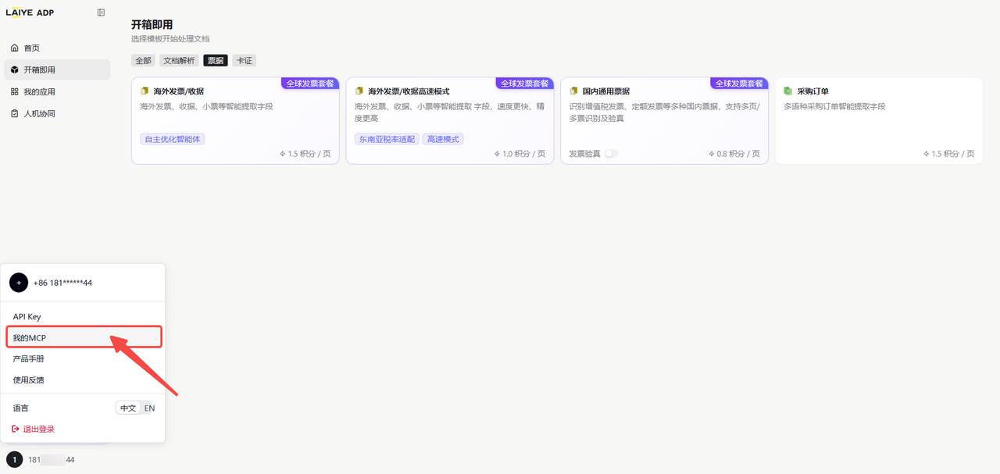
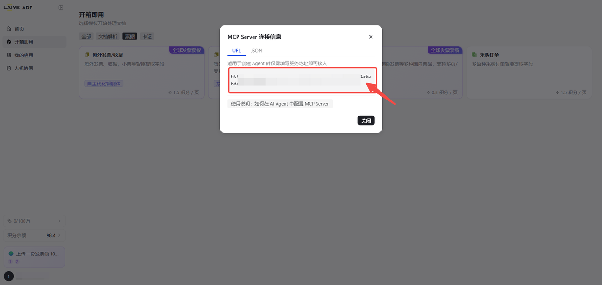
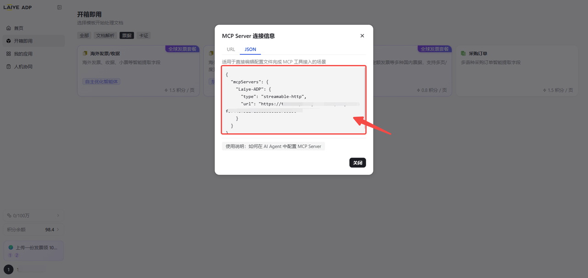

## 关于 ADP MCP Server

ADP MCP Server 是来也科技**智能体文档处理产品 (Agentic Document Processing，简称 ADP)** 的 Model Context Protocol 服务端，让任何支持 MCP 协议的 AI 客户端（Claude Desktop、Cursor、Copilot Chat、通义灵码、Coze 等）无需编写代码即可调用 ADP 的文档解析与抽取能力。与 CLI 工具不同，MCP Server 以 **Streamable HTTP** 传输运行，一条连接即可发现所有可用工具、调用处理、查询结果——完全在对话窗口内完成。

ADP 产品深度融合视觉语言模型（VLM）、大语言模型（LLM）与智能体自主决策技术，彻底颠覆传统文档处理模式，将行业沿用多年的规则驱动的机械字段抽取，全面升级为目标驱动的全流程智能自动化。产品专注于各类业务单据智能化处理，可对海外发票、国内票据、采购合同、物流单据、金融报表、交易合同等文件自动分类并精准抽取关键字段，同时支持表格解析、内容核验与多语种识别，无需人工搭建模板、标注数据和维护规则，高效完成大批量文档处理工作。


---

## 快速接入

### 1. 获取 API Key

访问 [https://adp.laiye.com/](https://adp.laiye.com/?utm_source=github) 注册 ADP 账号，在个人设置「我的MCP」中获取 API Key。

<div align="center">
  
  
  
</div>

### 2. 配置 MCP 客户端

ADP MCP Server 以 **stdio** 方式运行，客户端通过 `npx` 拉起本地进程，API Key 经环境变量传入。在客户端的 MCP 配置文件（如 Claude Desktop 的 `claude_desktop_config.json`、Cursor 的 `mcp.json`）中添加：

```json
{
  "mcpServers": {
    "adp": {
      "command": "npx",
      "args": ["-y", "@laiye-adp/mcp"],
      "env": {
        "ADP_API_KEY": "<YOUR-ADP-API-Key>"
      }
    }
  }
}
```

其他客户端配置方式同理，核心参数：

| 参数 | 值 |
|------|---|
| **Command** | `npx` |
| **Args** | `["-y", "@laiye-adp/mcp"]` |
| **Transport** | stdio |
| **认证方式** | 环境变量 `ADP_API_KEY=<YOUR-ADP-API-Key>` |

> 可选环境变量 `ADP_ACCEPT_LANGUAGE`（`zh` / `en`，默认 `zh`）用于切换接口语言与域名。
> 要求本地已安装 Node.js 20+。

### 3. 开始使用

连接成功后，AI 客户端会自动发现所有可用的 ADP 工具。直接在对话中描述你的需求即可，例如：

- "帮我解析这份 PDF 的结构"
- "提取这张身份证的信息"
- "从这张发票里抽取金额和日期"

---

## 工具列表

### 文档解析

| 工具名 | 标题 | 说明 |
|--------|------|------|
| `parse_document` | 通用文档解析 | 对 PDF、图片、Word、Excel、PPT 等文档进行版面解析，返回结构化的文本块、表格、阅读顺序与页面坐标。适用于不确定文档类型、需要先获取原始结构再做后续处理的场景；如已确认是发票、证件等特定类型，请优先使用对应的专用提取工具。 |

### 票据与订单抽取

| 工具名 | 标题 | 说明 |
|--------|------|------|
| `extract_china_invoice` | 中国票据 | 覆盖中国地区 30+ 种常见票据：支持全电发票、普通发票、专用发票、出租车票、火车票、飞机行程单、财政发票等财务场景常见票据。可从票据中提取发票号码、开票日期、金额、购买方、销售方等关键信息，以及支持判断发票真假。 |
| `extract_global_invoice` | 海外发票/收据 | 从 PDF 或图片格式的海外发票、收据、票据中提取关键字段（发票号、开票日期、金额、税额、币种、明细行等）。适用于跨境贸易、报销、应付账款自动化等场景；中国大陆增值税发票请使用专门的国内发票工具。 |
| `extract_purchase_order` | 订单 | 从 PDF 或图片格式的采购订单、销售订单中提取关键字段（订单号、买卖双方信息、下单日期、商品明细、数量、单价、总金额、收货地址等）。适用于电商订单录入、供应链对账、出入库管理自动化等场景。 |

### 卡证抽取

| 工具名 | 标题 | 说明 |
|--------|------|------|
| `extract_id_card` | 身份证 | 从中国大陆居民身份证图片中提取关键字段（姓名、性别、民族、出生日期、身份证号、住址、签发机关、有效期等），支持正反面识别。适用于实名认证、用户注册等场景。 |
| `extract_bank_card` | 银行卡 | 从银行卡正面图片中提取关键字段（卡号、所属银行、卡种类型、有效期等）。适用于绑卡、收款账户录入、支付渠道配置等场景。注意：仅识别卡面公开信息，不涉及 CVV 等敏感字段。 |
| `extract_vehicle_cert` | 车辆合格证 | 从机动车整车出厂合格证图片中提取关键字段（合格证编号、车辆品牌、型号、车辆识别代号 VIN、发动机号、制造日期等）。适用于车辆上户、二手车交易、车辆资产管理等场景。 |
| `extract_account_permit` | 开户许可证 | 从企业开户许可证图片中提取关键字段（企业名称、基本账户账号、开户银行、核准号、发证日期等）。适用于对公收款账户校验、企业财务审核、应付账款收款方信息核对等场景。 |
| `extract_driver_license` | 驾驶证 | 从中国机动车驾驶证图片中提取关键字段（姓名、性别、国籍、出生日期、驾驶证号、准驾车型、初次领证日期、有效期等），支持正副页识别。适用于驾驶员资质核验、网约车/货运司机准入审核等场景。 |
| `extract_business_license` | 营业执照 | 从中国企业营业执照图片中提取关键字段（企业名称、统一社会信用代码、法定代表人、注册资本、成立日期、经营范围、注册地址等）。适用于企业开户、商户入驻、供应商资质审核、企业实名认证等场景。 |
| `extract_passport_cn` | 护照-中国 | 从中华人民共和国护照图片中提取关键字段（中文姓名、姓名拼音、性别、出生日期、护照号、国籍、签发日期、有效期、签发机关等）。适用于出境业务、跨境身份核验、签证办理等场景；外国护照不在支持范围内。 |
| `extract_vehicle_license` | 行驶证 | 从中国机动车行驶证图片中提取关键字段（车牌号、车辆类型、所有人、车辆识别代号 VIN、发动机号、注册日期、发证日期等），支持正副页识别。适用于车辆登记、保险投保、网约车/货运车辆准入等场景。 |
| `extract_org_code_cert` | 组织机构代码证 | 从组织机构代码证图片中提取关键字段（机构名称、组织机构代码、法定代表人、地址、发证日期、有效期等）。适用于历史档案数字化、存量企业资质核验等场景；新办企业建议使用营业执照工具。 |
| `extract_household_book` | 户口本 | 从中国居民户口本图片中提取关键字段（户号、户别、住址、家庭成员列表，含成员姓名、身份证号、与户主关系等），支持首页与个人页两种页面类型。适用于户籍核验、亲属关系认证、社保业务等场景。 |
| `extract_hk_macao_permit` | 港澳通行证 | 从港澳通行证（往来港澳通行证）图片中提取关键字段（姓名、性别、出生日期、证件号、签发日期、有效期、签发机关等）。适用于出入境业务、酒店登记、票务实名等场景。 |

### 自定义抽取

除上述开箱即用工具外，MCP 提供两个固定工具来使用你在 ADP 平台上创建的自定义抽取应用：

| 工具名 | 标题 | 说明 |
|--------|------|------|
| `list_custom_extract_apps` | 列出自定义抽取应用 | 列出当前用户创建的所有自定义文档抽取应用，返回每个应用的 ID、名称、描述、标签和输出字段定义。可用于查找 `execute_custom_extract_app` 所需的 `app_id`。 |
| `execute_custom_extract_app` | 执行自定义抽取应用 | 使用指定的自定义文档抽取应用处理文件。需先通过 `list_custom_extract_apps` 获取可用的 `app_id`。 |

**使用流程：** 先调用 `list_custom_extract_apps` 查看可用应用列表，获取目标应用的 `app_id`，再调用 `execute_custom_extract_app` 传入 `app_id` 与文件进行抽取。

---

## 工具输入参数

### 文档解析与 OOTB 抽取工具

所有开箱即用工具共享统一的输入 Schema：

| 参数 | 类型 | 必填 | 说明 |
|------|------|------|------|
| `file` | string | 是 | 文件 URL 或 Base64 编码内容 |
| `file_name` | string | 否 | 文件名（含扩展名） |
| `with_rec_result` | boolean | 否 | 是否包含 OCR 中间结果，默认 `true` |
| `wait` | boolean | 否 | 是否同步等待结果，默认 `true` |
| `timeout_seconds` | integer | 否 | 同步等待超时秒数，默认 `300`，范围 1–900 |

### execute_custom_extract_app

在上述参数基础上增加：

| 参数 | 类型 | 必填 | 说明 |
|------|------|------|------|
| `app_id` | string | 是 | 自定义抽取应用 ID（通过 `list_custom_extract_apps` 获取） |

### list_custom_extract_apps

无需输入参数。

**文件传入方式：**

- **URL**：`file` 传入以 `http://`、`https://`、`file://` 开头的可访问链接
- **Base64**：`file` 传入 Base64 编码的文件内容（非 URL 格式时自动识别）

**同步 vs 异步：**

- `wait=true`（默认）：阻塞等待处理完成，直接返回结果
- `wait=false`：立即返回 `task_id`，后续可查询任务状态

---

## 工具输出

### parse_document 输出

```json
{
  "task_id": "fabd7f0a4e7211f1bbc4d85ed35661fd",
  "status": 4,
  "message": "",
  "doc_recognize_result": [
    {
      "page_num": 1,
      "document_content": "Full text content of this page...",
      "document_details": [
        {
          "type": "Text",
          "text": "Paragraph content...",
          "position": [{"points": [{"x": 311, "y": 50}, {"x": 500, "y": 50}, {"x": 500, "y": 80}, {"x": 311, "y": 80}]}],
          "ocr_confidence": {
            "ocr_mean_confidence": 0.999,
            "ocr_min_confidence": 0.998,
            "is_overall_confidence": 1
          }
        },
        {
          "type": "Table",
          "text": "Column A\tColumn B\nValue 1\tValue 2",
          "position": [{"points": [...]}],
          "ocr_confidence": {...}
        },
        {
          "type": "Picture",
          "text": "https://adp.laiye.com/web/.../file/abc123",
          "position": [{"points": [...]}],
          "ocr_confidence": {...}
        }
      ]
    }
  ]
}
```

| 字段 | 类型 | 说明 |
|------|------|------|
| `task_id` | string | 任务 ID |
| `status` | integer | 任务状态码 |
| `message` | string | 状态消息 |
| `doc_recognize_result` | array | 各页识别结果 |
| `doc_recognize_result[].page_num` | integer | 页码（1 起始） |
| `doc_recognize_result[].document_content` | string | 该页完整文本（按阅读顺序） |
| `doc_recognize_result[].document_details` | array | 元素级详情 |
| `document_details[].type` | string | 元素类型：`Text`、`Table`、`Picture` |
| `document_details[].text` | string | 文本内容；Picture 类型为图片 URL |
| `document_details[].position` | array | 边界框坐标（4 个角点） |
| `document_details[].ocr_confidence.ocr_mean_confidence` | float | 平均 OCR 置信度 (0–1) |
| `document_details[].ocr_confidence.ocr_min_confidence` | float | 最低 OCR 置信度 (0–1) |

### extract 类工具输出

```json
{
  "task_id": "91283e544e7111f18cd6d85ed35661fd",
  "status": 4,
  "message": "",
  "extraction_result": [
    {
      "field_key": "invoice_number",
      "field_name": "发票号码",
      "field_values": [
        {
          "field_value": "24VLT0591617",
          "field_confidence": 1.0,
          "references": []
        }
      ]
    },
    {
      "field_key": "line_items",
      "field_name": "商品明细",
      "references": [],
      "field_confidence": 1.0,
      "table_values": [
        [
          {
            "field_name": "商品名称",
            "field_key": "line_items_description",
            "field_values": [
              {
                "field_value": "TESLA MODEL 3",
                "field_confidence": 1.0,
                "references": "Description: TESLA MODEL 3"
              }
            ]
          }
        ]
      ]
    }
  ]
}
```

**普通字段**（无 `table_values`）：

| 字段 | 类型 | 说明 |
|------|------|------|
| `field_key` | string | 字段标识 |
| `field_name` | string | 字段名称 |
| `field_values` | array | 提取值列表 |
| `field_values[].field_value` | string | 提取值 |
| `field_values[].field_confidence` | float | 置信度 (0–1) |

**表格字段**（含 `table_values`）：

| 字段 | 类型 | 说明 |
|------|------|------|
| `field_key` | string | 表格标识 |
| `field_name` | string | 表格名称 |
| `table_values` | array\[array\] | 二维数组：每行是一个单元格数组，每个单元格含 `field_name`、`field_key`、`field_values` |

**判断方式：** 字段对象包含 `table_values` → 表格字段；仅含 `field_values` → 普通字段。

### 异步返回（`wait=false`）

```json
{
  "task_id": "fabd7f0a4e7211f1bbc4d85ed35661fd",
  "status": "running"
}
```

---

## 任务状态码

| 状态码 | MCP 状态 | 说明 |
|--------|----------|------|
| 0 | running | 未知 |
| 1 | running | 就绪/排队中 |
| 2 | running | 处理中 |
| 4 | success | 成功 |
| 5 | failed | 失败 |
| 6 | failed | 已取消 |

---

## 支持的文件格式

| 格式 | 扩展名 | 说明 |
|------|--------|------|
| PDF | `.pdf` | 支持扫描件与电子版 |
| 图片 | `.jpg` `.jpeg` `.png` `.bmp` `.tiff` `.webp` | 支持手机拍摄件 |
| Word | `.doc` `.docx` | - |
| Excel | `.xls` `.xlsx` | - |
| PPT | `.ppt` `.pptx` | - |

---

## 认证说明

ADP MCP Server 使用 API Key 认证，通过环境变量 `ADP_API_KEY` 传入：

```json
"env": {
  "ADP_API_KEY": "<YOUR-ADP-API-Key>"
}
```

- API Key 可在 ADP 控制台「我的MCP」页面获取
- 每个 API Key 绑定一个用户，仅可访问该用户下的应用与数据
- API Key 仅以环境变量形式传入本地进程，不会出现在请求体或响应中

---

## 常见问题

**Q: MCP 连接后看不到某些卡证工具？**

A: 工具列表按当前用户的已初始化应用动态生成。首次连接时系统会自动初始化所有开箱即用应用，初始化完成后刷新工具列表即可看到全部工具。

**Q: 卡证工具返回「文档抽取失败」？**

A: 请确认上传的文件与工具类型匹配（例如：身份证图片使用 `extract_id_card`，不要用 `extract_vehicle_cert`）。文件格式需为支持的图片或 PDF。

**Q: 超时怎么处理？**

A: 默认超时 300 秒（5 分钟），可通过 `timeout_seconds` 参数调整（最大 900 秒）。大文件或复杂文档建议使用 `wait=false` 异步模式，再通过 `task_id` 查询结果。

**Q: 与 ADP CLI / OpenAPI 有什么区别？**

A: 三者功能等价，区别仅在接入方式：

| 接入方式 | 适合场景 |
|----------|----------|
| **MCP Server** | AI 客户端（Claude Desktop、Cursor 等）直接调用，无需写代码 |
| **ADP CLI** | 终端命令行、脚本自动化、AI Skill 集成 |
| **OpenAPI** | 业务系统集成、后端服务调用 |

---

## 授权许可

- **MCP Server**：免费接入，作为 ADP 产品的一部分提供
- **ADP 服务**：基于公有云的 AI 文档处理服务，按使用量计费

免费额度：新用户注册后每月可获得 **100 免费积分**

[立即体验](https://adp.laiye.com/?utm_source=github)

---

## 支持与联系

- **API 接口文档：** [Open API 使用指南](https://laiye-tech.feishu.cn/wiki/PO9Jw4cH3iV2ThkMPW2c539pnkc)
- **ADP 产品操作手册：** [公有云操作手册](https://laiye-tech.feishu.cn/wiki/UDYIwG42pisBbFkJI39ctpeKnWh)
- **邮箱：** mkt@laiye.com
- **官网：** [来也科技](https://laiye.com/product/adp-platform)

<div align="center">

**用 ❤️ 构建智能体 AI 的未来**
版权所有 © 2026 [来也科技（北京）有限公司] 保留所有权利。

</div>
